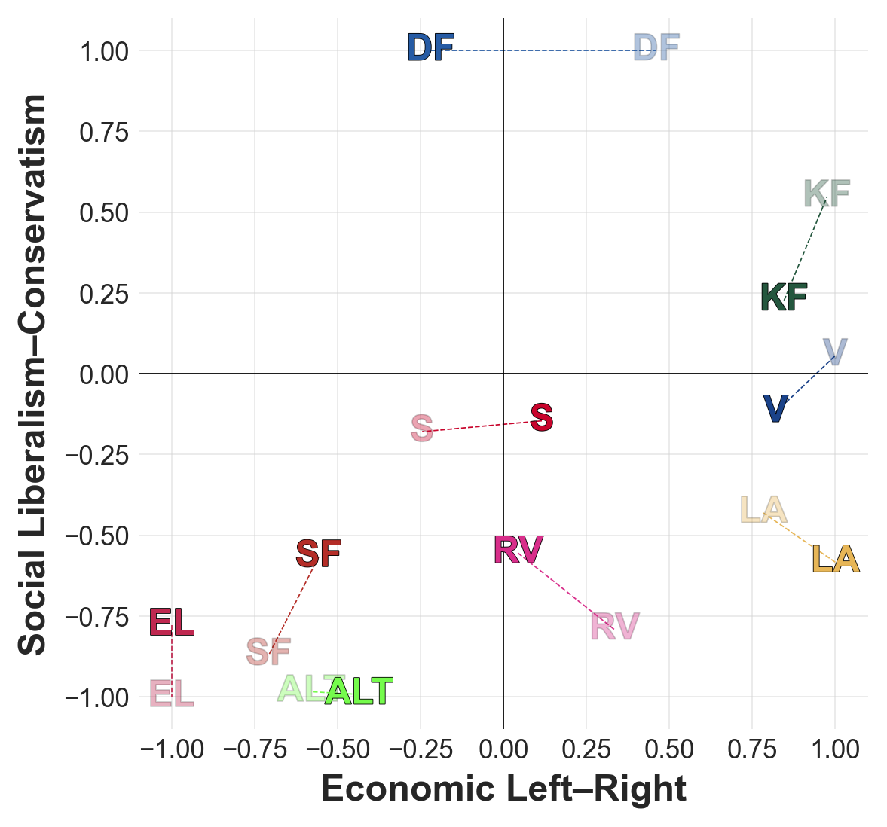

**Notes:**

- REPO UNDER CONSTRUCTION! To be expanded...

# Generalised Political Scaling

This repository contains replication data and code for the research paper *A Generalised Approach to Scaling Political Actors with Embedding Representations*, written as my master's thesis @ [SODAS, UCPH](https://sodas.ku.dk/). Scripts for preprocessing, modelling, and validation are provided here. **Note thah code documentation, refactoring, and general clean-up is ongoing**. Link to the paper will be provided upon publication.

For documentation of the collection of parliamentary transcripts, please refer to my [data collection repo](https://github.com/mathiasbruun/DCPA) which additionally documents the retrieval of political tweets and Meta ads. Embedding files are quite large and thus hosted on LFS.

For installation of the `politician2vec` package, see [its dedicated repo](https://github.com/mathiasbruun/politician2vec). Note that all functionality provided is still in an **early experimental stage**! Some functionality developed as part of this project is yet to be added to the package proper.
